# Decisiones de diseño:

## Mapa del sitio:
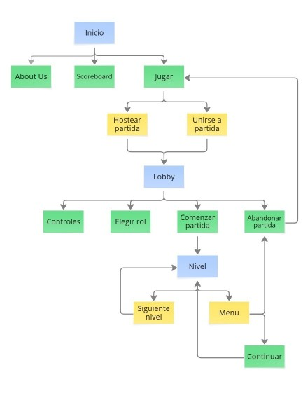

## Wireflow del flujo principal del juego:
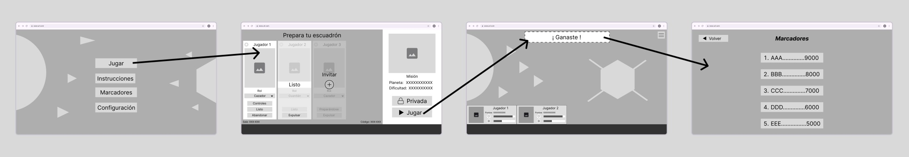

## Diseño individual en papel de cada integrante:
A continuación, se muestran las ideas de cada integrante generadas
aplicando la metodología de "Crazy 8's".

### Josué:
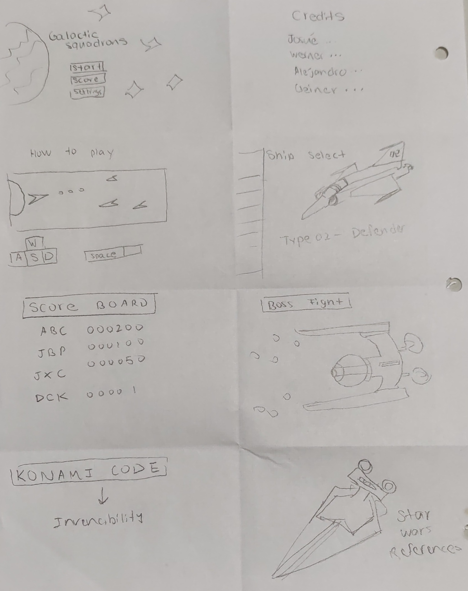

### Werner:
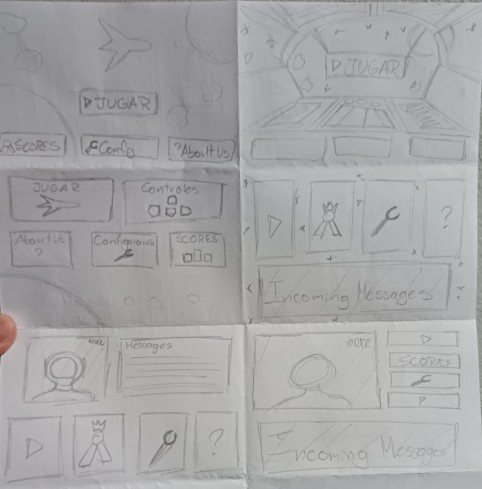

### Alejandro:
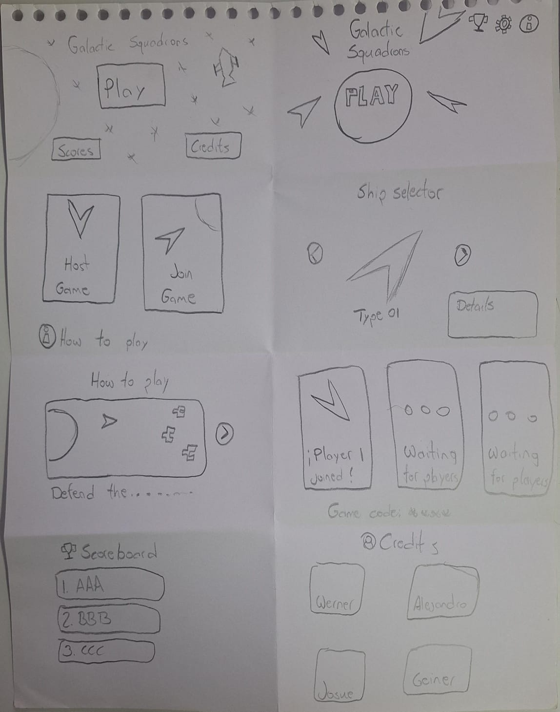

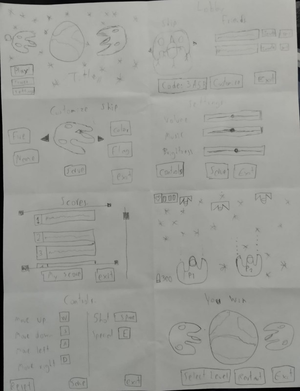

### Geiner:

## Acuerdos de grupo:
Tras votaciones, el equipo esogió los siguientes diseños base para los wireframes:

### Home:
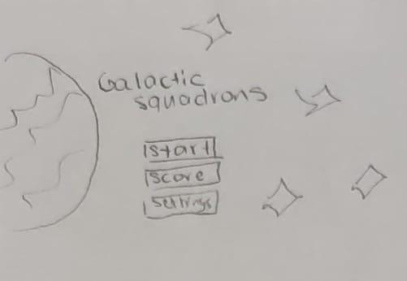

### Lobby:
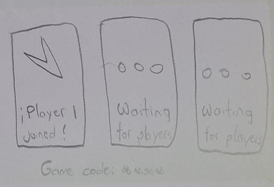

### Rules:
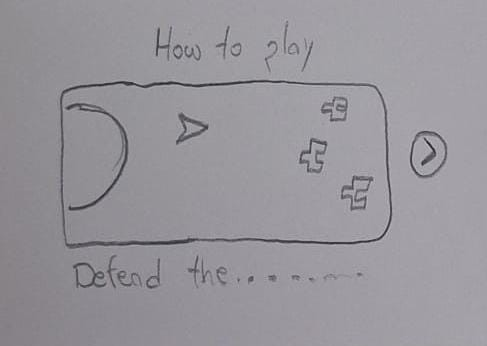

### Game:
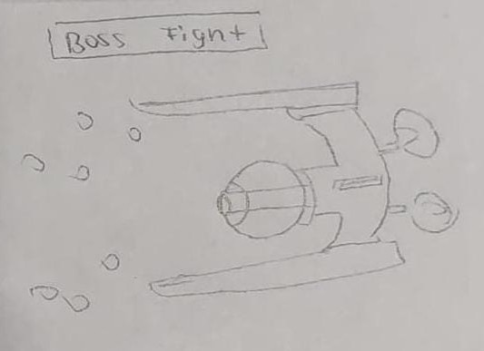

### About:
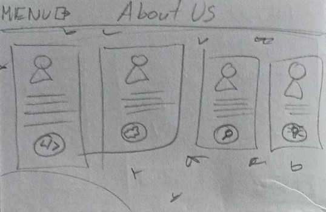

## Wireframes finales

### Home:
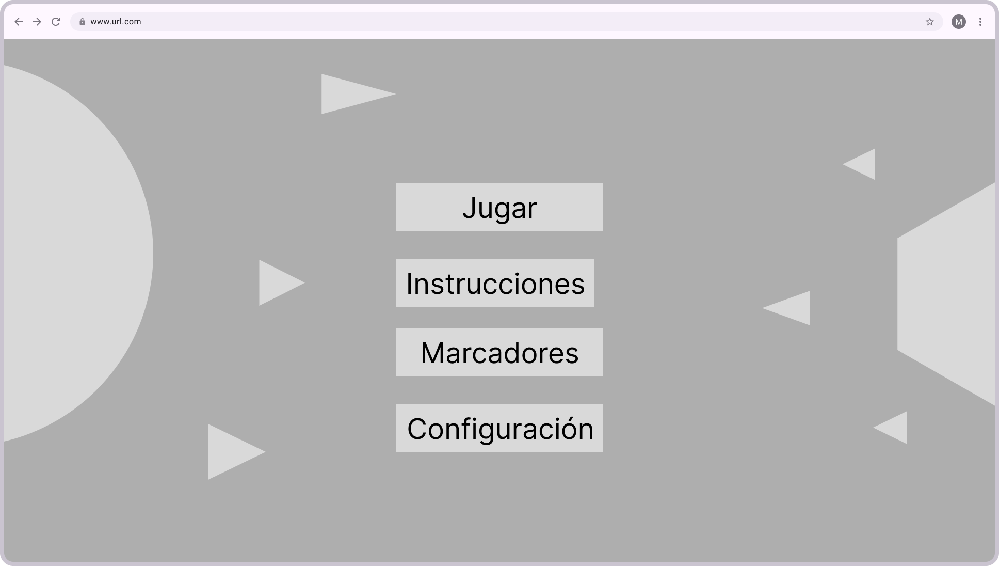

### Lobby:
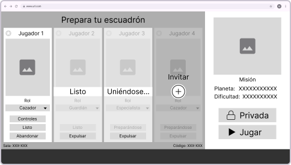

### Rules:
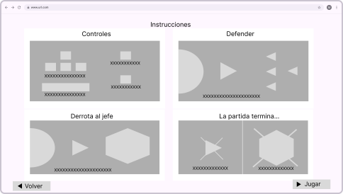

### Gameplay:
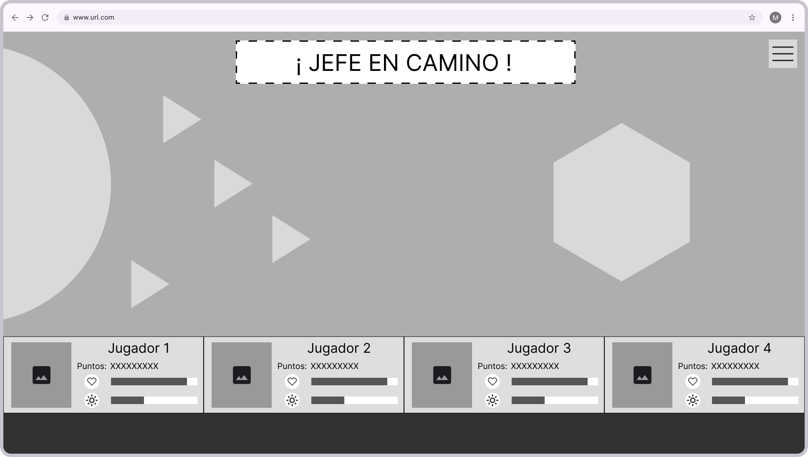

### Scoreboard:
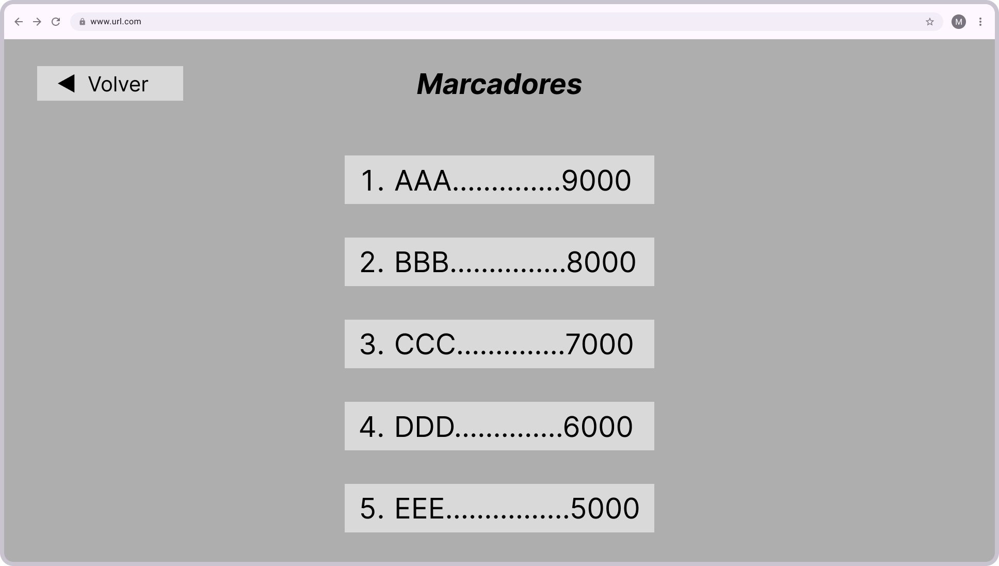

### About:
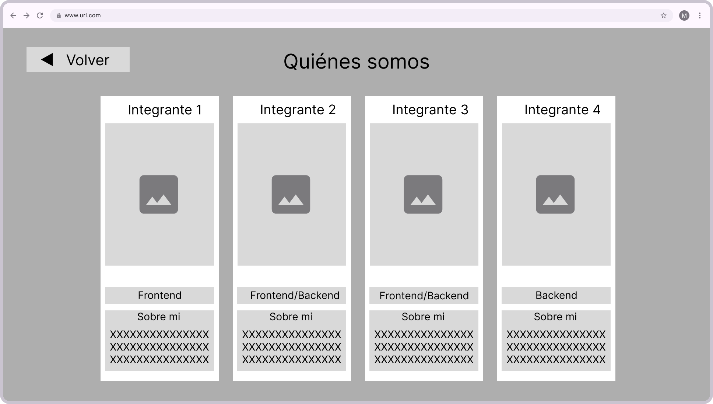
