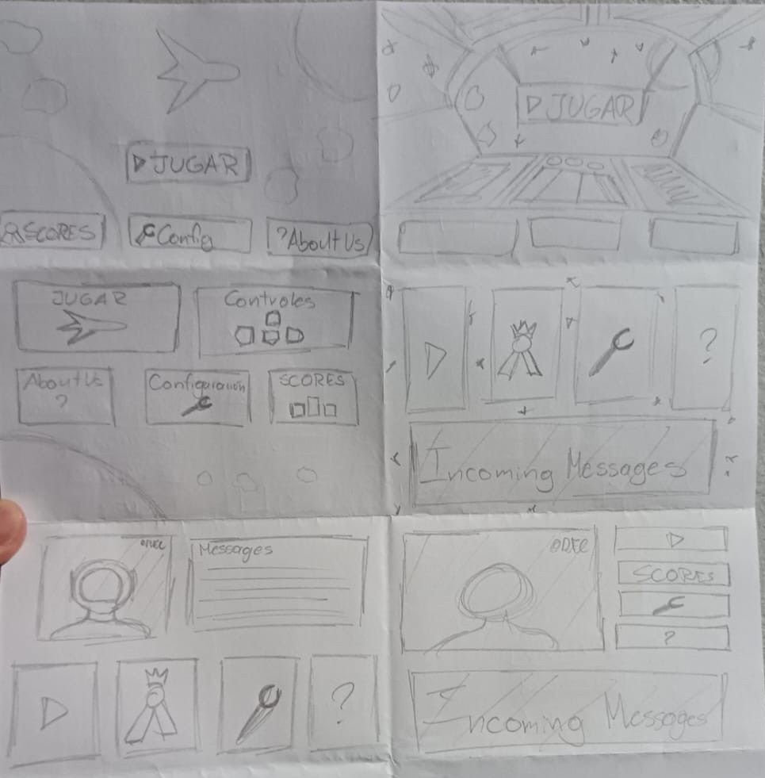
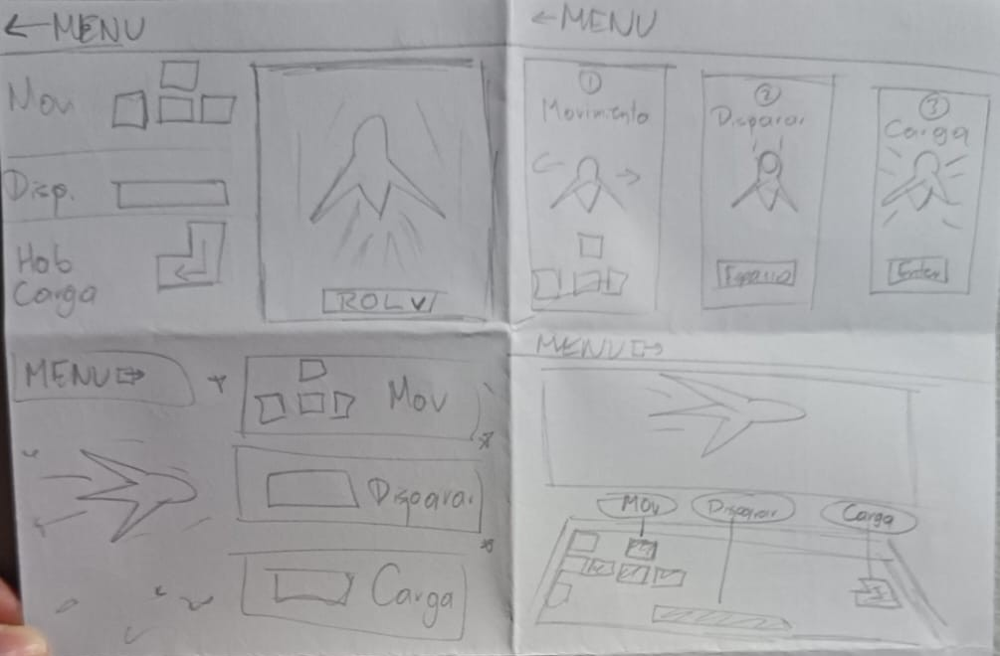
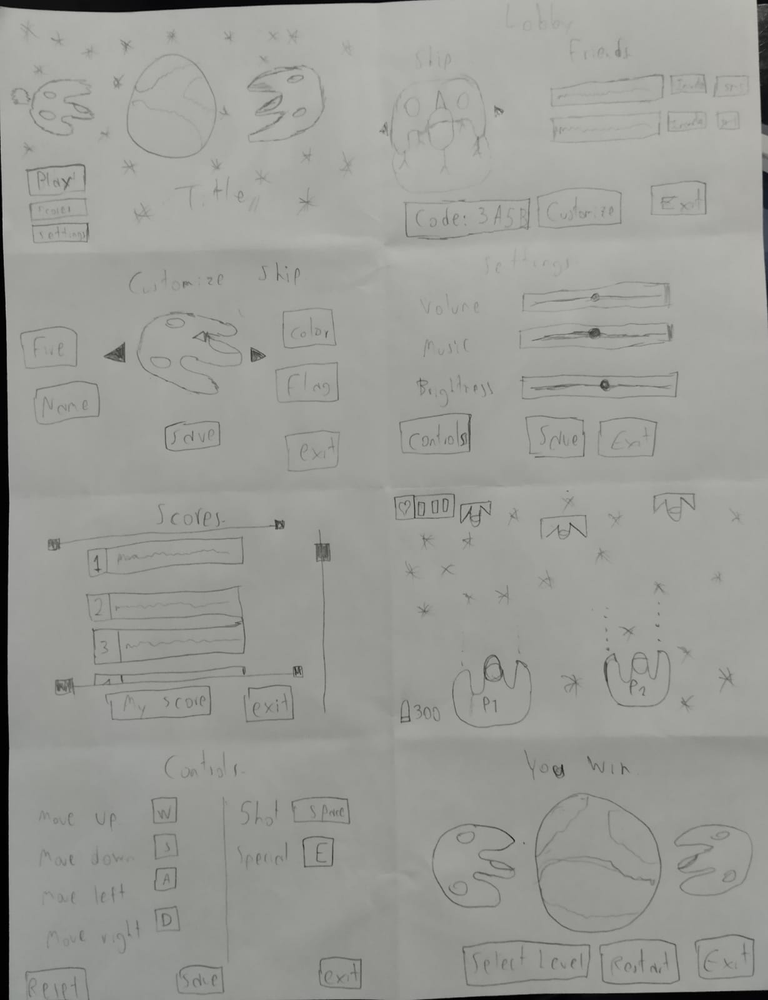

# Decisiones de diseño:

## Mapa del sitio:

## Wireflow del flujo principal del juego:

## Diseño individual en papel de cada integrante:
A continuación se muestran las ideas de cada integrante generadas
aplicando la metodología de "Crazy 8's".

### Josué:

### Werner:

### Alejandro:

### Geiner:

## Acuerdos de grupo:
...
